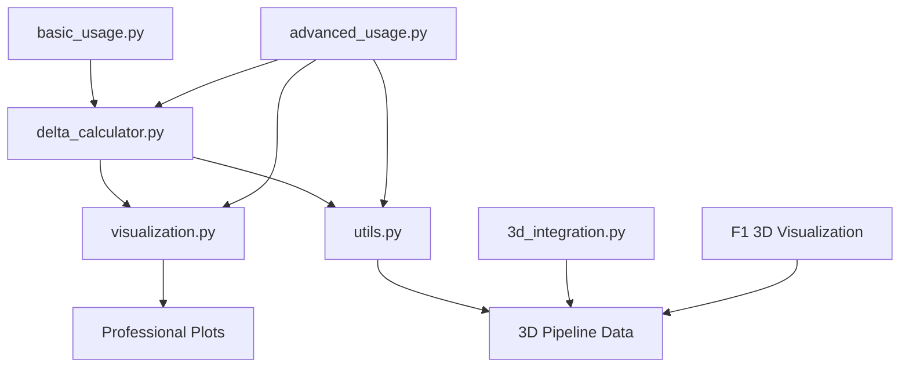

# Project Structure

This document outlines the complete repository structure for the F1 Telemetry Delta Calculator.

## Repository Structure

```
f1-telemetry-delta-calculator/
├── README.md                          # Main project documentation
├── LICENSE                           # MIT license
├── setup.py                          # Package installation script
├── requirements.txt                  # Python dependencies
├── .gitignore                       # Git ignore patterns
├── PROJECT_STRUCTURE.md             # This file
│
├── f1_telemetry/                    # Main package directory
│   ├── __init__.py                  # Package initialization
│   ├── delta_calculator.py         # Core F1TelemetryDeltaCalculator class
│   ├── visualization.py            # Professional plotting functions
│   └── utils.py                     # Utility functions and 3D pipeline integration
│
├── examples/                        # Usage examples
│   ├── __init__.py
│   ├── basic_usage.py              # Simple getting-started example
│   ├── advanced_usage.py           # Advanced features and batch processing
│   └── 3d_pipeline_integration.py  # 3D visualization pipeline examples
│
├── tests/                          # Unit tests
│   ├── __init__.py
│   ├── test_calculator.py          # Test core calculation methods
│   ├── test_visualization.py       # Test plotting functions
│   └── test_utils.py              # Test utility functions
│
├── docs/                           # Documentation
│   ├── index.md                    # Documentation homepage
│   ├── installation.md            # Installation instructions
│   ├── user_guide.md              # User guide and tutorials
│   ├── api_reference.md           # Detailed API documentation
│   ├── methodology.md             # Technical methodology explanation
│   ├── 3d_integration.md          # 3D pipeline integration guide
│   └── troubleshooting.md         # Common issues and solutions
│
├── integration/                    # Integration guides and examples
│   ├── __init__.py
│   ├── blender_addon.py           # Blender addon for direct integration
│   ├── unity_importer.cs          # Unity C# script for data import
│   └── threejs_loader.js          # Three.js data loader
│
├── data/                          # Sample data and test cases
│   ├── sample_exports/            # Example JSON exports
│   ├── test_data/                # Test datasets
│   └── reference_deltas/         # Reference calculations for validation
│
├── scripts/                       # Utility scripts
│   ├── validate_installation.py   # Check if everything is working
│   ├── batch_processor.py         # Batch processing script
│   └── data_validator.py         # Validate F1 session data
│
└── .github/                      # GitHub specific files
    ├── workflows/                 # CI/CD workflows
    │   ├── tests.yml             # Automated testing
    │   └── publish.yml           # Package publishing
    ├── ISSUE_TEMPLATE/            # Issue templates
    └── pull_request_template.md   # PR template
```

## Key Components

### Core Package (`f1_telemetry/`)

**delta_calculator.py**
- Main `F1TelemetryDeltaCalculator` class
- Complete delta calculation pipeline
- Session management and data loading
- Integration with FastF1 API

**visualization.py**
- Professional F1-style plotting functions
- Multiple visualization styles (F1InsightsHub, broadcast, technical)
- Speed comparison plots
- Comprehensive dashboard creation

**utils.py**
- 3D pipeline integration functions
- Data export utilities
- Batch processing support
- Animation data preprocessing

### Examples (`examples/`)

**basic_usage.py**
- Simple getting-started example
- Shows core functionality
- Basic visualization

**advanced_usage.py**
- Multiple visualization styles
- Batch processing
- Custom analysis examples
- Error handling demonstrations

**3d_pipeline_integration.py**
- Direct integration with 3D visualization pipeline
- Data export optimization
- Animation data preparation

### Documentation (`docs/`)

Comprehensive documentation covering:
- Installation and setup
- User guides and tutorials
- Complete API reference
- Technical methodology
- 3D integration guidelines
- Troubleshooting guides

### Integration (`integration/`)

Platform-specific integration examples:
- Blender addon for direct import
- Unity C# scripts
- Three.js data loaders
- Generic JSON import templates

## File Relationships



## Installation and Setup

1. **Clone the repository:**
```bash
git clone https://github.com/yourusername/f1-telemetry-delta-calculator.git
cd f1-telemetry-delta-calculator
```

2. **Install dependencies:**
```bash
pip install -r requirements.txt
```

3. **Install package in development mode:**
```bash
pip install -e .
```

4. **Validate installation:**
```bash
python scripts/validate_installation.py
```

## Usage Workflow

1. **Initialize Calculator**
   ```python
   from f1_telemetry import F1TelemetryDeltaCalculator
   calculator = F1TelemetryDeltaCalculator(2024, 'Q', 'BAHRAIN')
   ```

2. **Calculate Delta**
   ```python
   delta, distances, summary_df, t1, t2 = calculator.calculate_delta('VER', 'HAM')
   ```

3. **Create Visualizations**
   ```python
   calculator.plot_comparison(delta, distances, 'VER', 'HAM', t1, t2, style='f1insights')
   ```

4. **Export for 3D Pipeline**
   ```python
   filename = calculator.export_data(delta, distances, summary_df, 'VER', 'HAM', t1, t2)
   ```

5. **Use in 3D Application**
   - Load exported JSON in your 3D software
   - Reference: [F1 3D Visualization](https://github.com/lohithburra01/F1-3D-VISUALIZATION)

## Development Guidelines

### Code Style
- Follow PEP 8 conventions
- Use type hints for all functions
- Comprehensive docstrings
- Error handling for all external API calls

### Testing
- Unit tests for all core functions
- Integration tests with sample data
- Performance benchmarks
- Validation against reference data

### Documentation
- Clear examples for all features
- API reference with parameter descriptions
- Methodology explanations
- Integration guides

## Integration with 3D Visualization Pipeline

This calculator is designed to work seamlessly with the [F1 3D Visualization Pipeline](https://github.com/lohithburra01/F1-3D-VISUALIZATION):

1. **Data Flow:**
   ```
   F1 API → Delta Calculator → JSON Export → 3D Pipeline → Rendered Animation
   ```

2. **Key Export Features:**
   - Position markers for animation keyframes
   - Speed zones for visual emphasis
   - Overtaking zones for dramatic moments
   - Camera waypoints for optimal viewing

3. **File Formats:**
   - JSON for data exchange
   - PNG/SVG for static visualizations
   - Compatible with Blender, Unity, Three.js

## Contributing

1. Fork the repository
2. Create a feature branch
3. Follow the development guidelines
4. Add tests for new functionality
5. Update documentation
6. Submit a pull request

## Support

- Check the documentation in `docs/`
- Run example scripts in `examples/`
- Review troubleshooting guide
- Open issues on GitHub for bugs
- Discussions for questions and ideas
